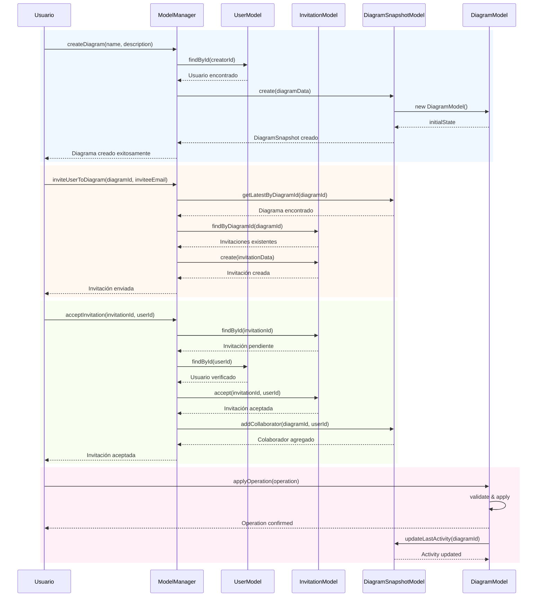
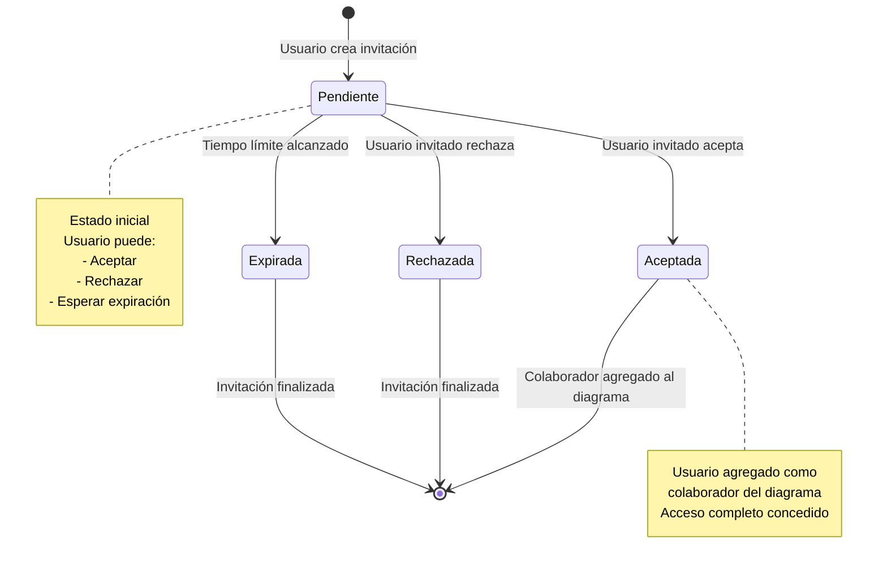
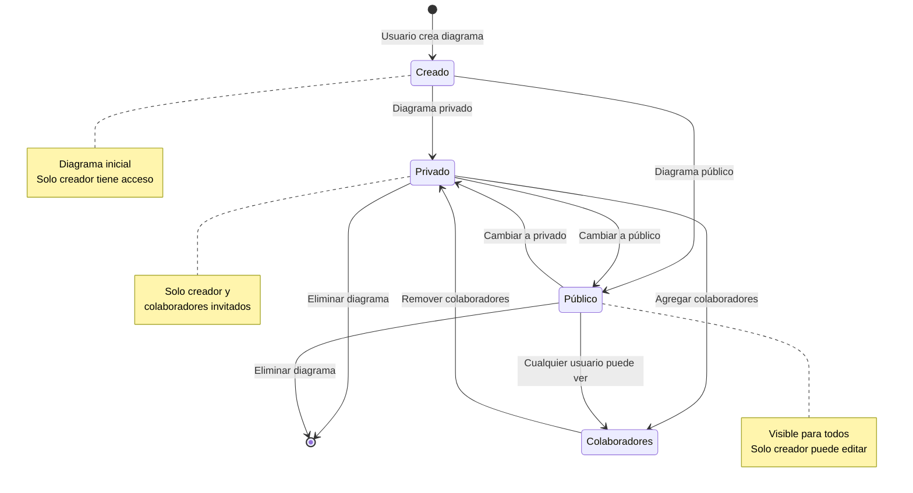

# Diagrama de Secuencia - Flujo de Invitaciones

```mermaid
sequenceDiagram
    participant U as Usuario
    participant MM as ModelManager
    participant UM as UserModel
    participant IM as InvitationModel
    participant DSM as DiagramSnapshotModel
    participant DM as DiagramModel

    %% Creación de diagrama
    rect rgb(240, 248, 255)
        U->>MM: createDiagram(name, description)
        MM->>UM: findById(creatorId)
        UM-->>MM: Usuario encontrado
        MM->>DSM: create(diagramData)
        DSM->>DM: new DiagramModel()
        DM-->>DSM: initialState
        DSM-->>MM: DiagramSnapshot creado
        MM-->>U: Diagrama creado exitosamente
    end

    %% Invitación de colaborador
    rect rgb(255, 248, 240)
        U->>MM: inviteUserToDiagram(diagramId, inviteeEmail)
        MM->>DSM: getLatestByDiagramId(diagramId)
        DSM-->>MM: Diagrama encontrado
        MM->>IM: findByDiagramId(diagramId)
        IM-->>MM: Invitaciones existentes
        MM->>IM: create(invitationData)
        IM-->>MM: Invitación creada
        MM-->>U: Invitación enviada
    end

    %% Aceptación de invitación
    rect rgb(248, 255, 240)
        U->>MM: acceptInvitation(invitationId, userId)
        MM->>IM: findById(invitationId)
        IM-->>MM: Invitación pendiente
        MM->>UM: findById(userId)
        UM-->>MM: Usuario verificado
        MM->>IM: accept(invitationId, userId)
        IM-->>MM: Invitación aceptada
        MM->>DSM: addCollaborator(diagramId, userId)
        DSM-->>MM: Colaborador agregado
        MM-->>U: Invitación aceptada
    end

    %% Colaboración en tiempo real
    rect rgb(255, 240, 248)
        U->>DM: applyOperation(operation)
        DM->>DM: validate & apply
        DM-->>U: Operation confirmed
        DM->>DSM: updateLastActivity(diagramId)
        DSM-->>DM: Activity updated
    end
```

## Flujo de Estados - Invitaciones

```mermaid
stateDiagram-v2
    [*] --> Pendiente: Usuario crea invitación

    Pendiente --> Aceptada: Usuario invitado acepta
    Pendiente --> Rechazada: Usuario invitado rechaza
    Pendiente --> Expirada: Tiempo límite alcanzado

    Aceptada --> [*]: Colaborador agregado al diagrama
    Rechazada --> [*]: Invitación finalizada
    Expirada --> [*]: Invitación finalizada

    note right of Pendiente
        Estado inicial
        Usuario puede:
        - Aceptar
        - Rechazar
        - Esperar expiración
    end note

    note right of Aceptada
        Usuario agregado como
        colaborador del diagrama
        Acceso completo concedido
    end note
```

## Diagrama de Estados - Diagramas

```mermaid
stateDiagram-v2
    [*] --> Creado: Usuario crea diagrama

    Creado --> Privado: Diagrama privado
    Creado --> Público: Diagrama público

    Privado --> Público: Cambiar a público
    Público --> Privado: Cambiar a privado

    Privado --> [*]: Eliminar diagrama
    Público --> [*]: Eliminar diagrama

    state "Colaboradores" as Collabs
    Privado --> Collabs: Agregar colaboradores
    Público --> Collabs: Cualquier usuario puede ver
    Collabs --> Privado: Remover colaboradores

    note right of Creado
        Diagrama inicial
        Solo creador tiene acceso
    end note

    note right of Privado
        Solo creador y
        colaboradores invitados
    end note

    note right of Público
        Visible para todos
        Solo creador puede editar
    end note
```
