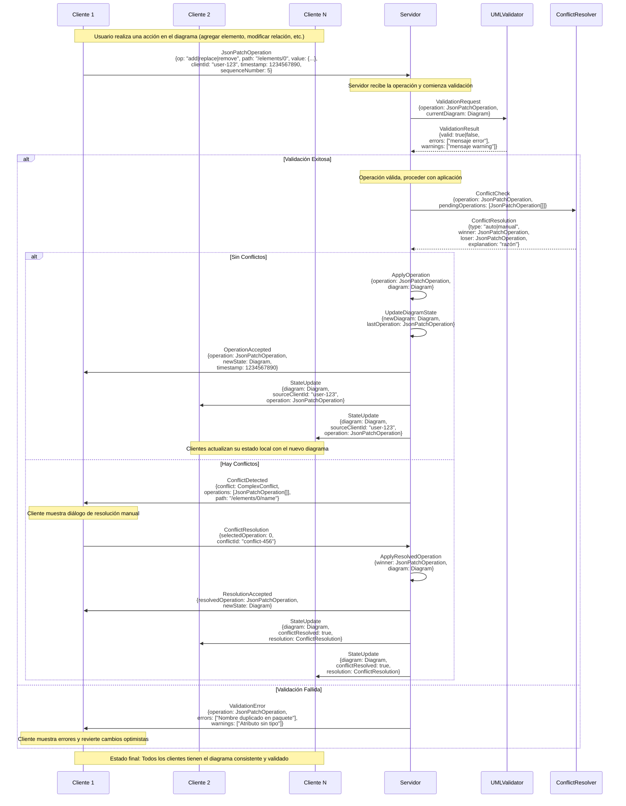

# Diagrama de Flujo de Datos - Sistema de Colaboración UML

Este diagrama muestra el flujo completo de datos en el sistema de colaboración híbrido, desde que una operación nace en un cliente hasta que se distribuye a todos los participantes conectados.



## Leyenda de Tipos de Datos

### Operaciones JSON Patch

```json
{
  "op": "add|replace|remove|move|copy|test",
  "path": "/elements/0/name",
  "value": "NuevoNombre",
  "from": "/elements/1",
  "clientId": "user-123",
  "timestamp": 1234567890,
  "sequenceNumber": 5
}
```

### Estado del Diagrama

```json
{
  "id": "diagram-456",
  "elements": [
    {
      "id": "element-1",
      "type": "class",
      "name": "MiClase",
      "package": "com.example",
      "attributes": ["-atributo: String"],
      "methods": ["+metodo(): void"]
    }
  ],
  "relationships": [
    {
      "id": "rel-1",
      "type": "association",
      "source": "element-1",
      "target": "element-2",
      "sourceCardinality": "1",
      "targetCardinality": "0..*"
    }
  ],
  "lastModified": 1234567890,
  "version": 42
}
```

### Resultados de Validación

```json
{
  "valid": false,
  "errors": [
    "Nombre 'MiClase' ya existe en el paquete 'com.example'",
    "Cardinalidad '1..2..*' no es válida"
  ],
  "warnings": ["Atributo 'atributo' no tiene tipo especificado"]
}
```

### Información de Conflictos

```json
{
  "id": "conflict-789",
  "operations": [
    {
      "clientId": "user-123",
      "timestamp": 1234567890,
      "op": "replace",
      "path": "/elements/0/name",
      "value": "NombreA"
    },
    {
      "clientId": "user-456",
      "timestamp": 1234567891,
      "op": "replace",
      "path": "/elements/0/name",
      "value": "NombreB"
    }
  ],
  "path": "/elements/0/name",
  "resolution": "manual"
}
```

## Flujo Principal Resumido

1. **Inicio**: Usuario edita diagrama → `JsonPatchOperation`
2. **Validación UML**: Servidor valida reglas UML (nombres únicos, cardinalidad, tipos de relación, etc.) → `ValidationResult`
3. **Detección de Conflictos**: Servidor detecta operaciones simultáneas → `ConflictResolution`
4. **Aplicación**: Servidor aplica cambios válidos → `Diagram` actualizado
5. **Distribución**: Broadcast a todos los clientes → `StateUpdate`
6. **Consistencia**: Todos los clientes sincronizados con diagrama validado

## Puntos Críticos

- **Validación Centralizada**: Solo el servidor puede modificar el estado oficial del diagrama
- **Reglas UML Estrictas**: Nombres únicos, cardinalidad válida, relaciones permitidas
- **Atomicidad**: Cada operación es tratada como una transacción completa
- **Consistencia Eventual**: Todos los clientes convergen al mismo estado validado
- **Resolución de Conflictos**: Auto-resolución para casos simples, manual para complejos
- **Tolerancia a Fallos**: Operaciones inválidas son rechazadas sin afectar el estado global
