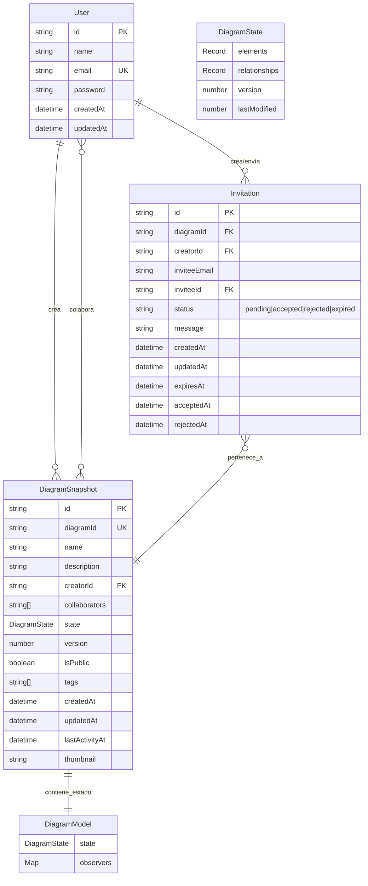

# Diagrama de Relaciones de Modelos



## Relaciones Detalladas

### 1. User → Invitation (1:N)

- **creatorId**: Usuario que crea la invitación
- **inviteeId**: Usuario que recibe la invitación (opcional, puede no existir aún)

### 2. User → DiagramSnapshot (1:N)

- **creatorId**: Usuario propietario del diagrama
- **collaborators[]**: Array de IDs de usuarios colaboradores

### 3. Invitation → DiagramSnapshot (N:1)

- **diagramId**: Diagrama al que se invita a colaborar

### 4. DiagramSnapshot → DiagramModel (1:1)

- **state**: Estado completo del diagrama en tiempo real
- Contiene elementos, relaciones y metadatos del diagrama

## Flujo de Trabajo Típico

1. **Usuario crea diagrama**:

   ```
   User → DiagramSnapshot (crea)
   DiagramSnapshot → DiagramModel (inicializa estado)
   ```

2. **Usuario invita colaborador**:

   ```
   User → Invitation (crea invitación)
   Invitation → DiagramSnapshot (referencia diagrama)
   ```

3. **Colaborador acepta invitación**:

   ```
   Invitation.status = "accepted"
   DiagramSnapshot.collaborators += userId
   ```

4. **Colaboración en tiempo real**:
   ```
   DiagramSnapshot.state ↔ DiagramModel (sincronización)
   ```

## Notas de Implementación

- **Almacenamiento**: Actualmente en memoria (Map), preparado para migrar a BD
- **Versionado**: DiagramSnapshot maneja versiones del diagrama
- **Colaboración**: Sistema de permisos basado en creator/collaborators
- **Invitaciones**: Sistema de expiración y estados para gestión de acceso
